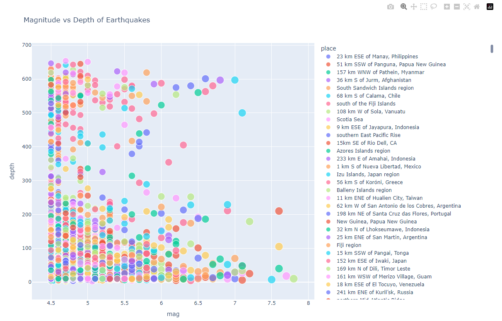

# Chefaa_Data_Scientist_Task
This Repo contains the solution to Technical Assessment for Data Scientist Role

# Repo Structure  
This repo contains 2 folders and 6 files as follows:  
- `data_manipulation_and_API.py` --> this file contains solution for **Part 1** of the task (Data Cleaning and Preparation, Data Analysis and Aggregation, and API utilization).

- `Statistical_Analysis.py` --> this file contains solution fot **Part 2** of the task (Statistical Analysis).

- `Chefaa_Task.ipynb` --> an interactive note book that contains the solution for whole task except **point 3 in part 1**. 

- `Chefaa_Task.html` --> an html file contains the ran notebook for a faster navigation. 

- `requirements.txt` --> contains the used python dependencies to solve this task.

- `Chefaa_Task_DashBoard.pbix` --> the Power BI dashboard file.

- `Data folder` --> contains the example data and the chosen data for interactive visuals names `earthquake.csv` along with output of the `data_manipulation_and_API.py` which is `manipulation_data_cleaned.csv`.

- `media folder` --> contains screenshots for the interactive plots using plotly, a screenshot and video for the dashboard.

# Python Version and Dependencies
The used python version for this task is `3.11` and all the used dependencies can be found in `requirements.txt` file.  


# Part 1: Programming and Data Manipulation (Python) Solution  

upon running the `data_manipulation_and_API.py` file the script will read `manipulation_data.csv` and process and clean it. after that it will export the cleaned file and then perform the required data analysis and aggregation. finally it will create an API using `Flask` with the required endpoints. you can access these endpoint by copying these two links
```code
    http://127.0.0.1:5000/top_n_employees?n=N
```
top N highest-paid employees. and the following to get the number of employees in department X. replacing `N` and `X` with the desired values.

```code
    http://127.0.0.1:5000/employee_count?department=X
```


# Part 2: Statistical Analysis

upon running the `Statistical_Analysis.py` file the script will read `regression_data.csv` and perform the linear regression analysis to predict house prices.

# Part 3: 

1. Dashboard Creation

    Here is a screenshot of the created dashboard along with its file and a video demo.  

     

    <video width="600" controls>
        <source src="media/Chefaa_Task_DashBoard - Power BI.mp4" type="video/mp4">
        Your browser does not support the video tag.
    </video>

2. Interactive Visualization

    I will be using an earthquake data set, The dataset represents global earthquake occurrences recorded over one year from January 1, 2023, to December 31, 2023. It includes detailed information about each earthquake event, such as its date, location, magnitude, and depth.

    - Map Plot  
        This map plot visualizes the locations of earthquakes around the world. Each point represents an earthquake, with its size and color corresponding to the earthquake's magnitude. The interactive map allows users to explore the geographical distribution and intensity of seismic activities globally.

         

    - Scatter Plot
       This scatter plot shows the relationship between the magnitude and depth of earthquakes. Each point represents an earthquake, with the size of the point indicating the earthquake's magnitude and the color representing its location. The plot allows users to examine how earthquake magnitudes vary with depth.

        

    - LinePlot  
        This line plot displays the number of earthquakes recorded each month over a specified period. The x-axis represents the months, while the y-axis shows the number of earthquakes. This plot helps in identifying trends and patterns in earthquake frequency over time.  

         
